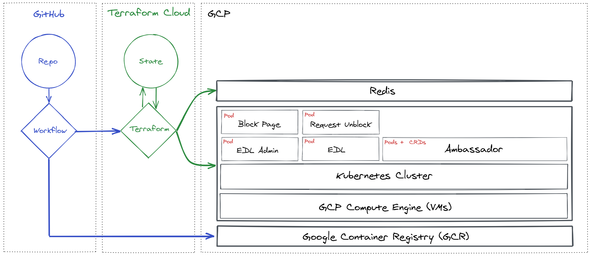

# Lab Architecture
### Overview

### Lab Components
| Component | Type | Description |
|--|--|--|
| **GitHub Repo** | - | The application code and Infrastructure-as-Code (Terraform) is stored here. |
| **GitHub Workflows** | - | GitHub Workflows is being used for CI/CD pipelines. |
| **Terraform Cloud** | - | Terraform Cloud runs the Terraform deployments and stores state. |
| **Redis** | Database | Redis (Google Cloud Memorystore) is used to store application data. |
| **Kubernetes Cluster** | Container Orchestrator | Kubernetes (Google Kubernetes Engine) is the platform for our containerized services. |
| **Ambassador** | Load Balancer | Ambassador is a Layer 7 load balancer with many useful features such as built-in authentication. It will be used to load balance in front of our containerized services, provide SSL termination, handle SSL certificate procurement/rotation via LetsEncrypt, and handle Authentication for our services by integrating with Okta for single-sign-on. |
| **Block Page** | Containerized Service | *Block Page* is a static web page hosted in an Nginx container. It simulates a URL Filtering block page that might be served by something like a NGFW. |
| **Request Unblock** | Containerized Service | *Request Unblock* is a Rust app that serves a web form where users can submit requests to unblock a web page. |
| **EDL Admin** | Containerized Service | *EDL Admin* is a Golang (Go) app that serves an admin panel where administrators can view unblock requests and then approve or deny them. |
| **EDL** | Containerized Service | *EDL* is a Python app that serves a list of the approved URLs as plain text. This type of list can be ingested by devices such as an NGFW to be used as a whitelist during URL Filtering. |
| **Lets Encrypt** | - | *LetsEncrypt* is a free Certificate Authority (CA). This will be used to enable HTTPS for the services. |
| **Prisma Cloud** | - | *Prisma Cloud* is Palo Alto Networks cloud security platform. You will experience some of it's capabilities on Day 2 of the lab. |
| **Okta** | - | *Okta* is a comprehensive identity platform. Okta will be used to provide authentication and single-sign-on for the services. |

### End User Workflow
Experience of a user who encounters a web page that has been blocked by the URL filter and wants to request that page be unblocked.

### Administrator Workflow
Experience of an administrator that wants to review and approve/reject web page unblock requests.

### Firewall/NGFW Workflow
Overview of a NGFW or other web filtering device pulling in the approved URLs for whitelisting.

## Continue to [Chapter 2](chapter2.md) (Accounts & Tools)