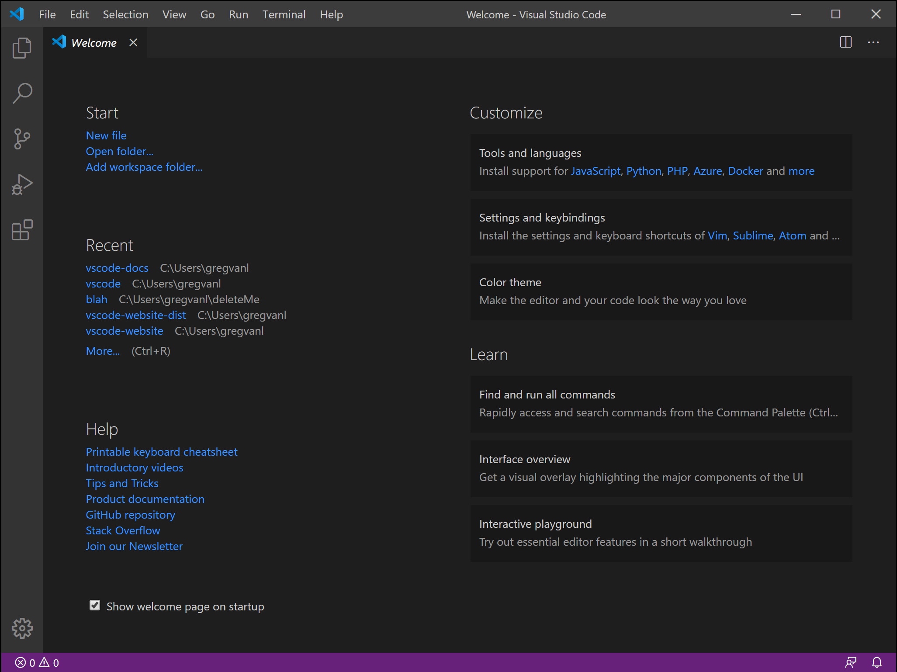

# 2. Accounts & Tools
### a. Accounts
You will need several accounts to complete the lab.

| Service | Notes |
|--|--|
| GitHub | If you don't already have a GitHub account, you can sign up here: https://github.com/join<br />We would recommend using a personal account. |
| Google Cloud | Provided for you. Accessible via the Okta portal with the credentials you received. |
| Terraform Cloud | Provided for you. Accessible via the Okta portal with the credentials you received. |
| Prisma Cloud | Provided for you. Accessible via the Okta portal with the credentials you received. |
| Okta | This account will be created on Day 3 (Thursday) |

After you have successfully signed into the Okta portal and completed setting up your GitHub account (or if you already have one), you can continue to the next step.

### b. Tools
 - [ ] **Install Git**
	* https://git-scm.com/download/win
	* After installing, run these commands in a terminal (PowerShell or cmd.exe):
		```
		git config --global user.name "John Doe"
		git config --global user.email john@doe.com
		git config --global credential.helper wincred
		```
	*(be sure to replace the values with your name and email!)*
 - [ ] **Install VS Code**
	* https://code.visualstudio.com/download
 - [ ] **Install the VS Code GitHub Extension**
	* [Install Extension](vscode:extension/GitHub.vscode-pull-request-github), or go here:
	* https://marketplace.visualstudio.com/items?itemName=GitHub.vscode-pull-request-github
 - [ ] **Install the VS Code Terraform Extension**
	* [Install Extension](vscode:extension/hashicorp.terraform), or go here:
	* https://marketplace.visualstudio.com/items?itemName=HashiCorp.terraform



### c. Sign VS Code into GitHub
 - [ ] Open VS Code
 - [ ] Select the GitHub Extension (GitHub icon [Octocat] on the left of the window)
 - [ ] Hit the *Sign In* button and follow the prompts

### d. Clone the Template Repo
 - [ ] Go to https://github.com/ae-business-solutions/DEEP608v5-Day-1
 - [ ] Press the `Use this template` button
 - [ ] Fill in a name and description for your repository
	* *Reminder: you should create the repo in your personal account (not your organization if you have one; this can be selected in the drop down menu in front of the repo name)*
 - [ ] Review the contents of the template repository

### e. Local Development Setup
 - [ ] Open VS Code
 - [ ] Press Ctrl+Shift+P; you should see a text field pop up at the top of VS Code
 - [ ] Type 'Git' and select 'Git: Clone' from the dropdown
 - [ ] Select 'Clone from GitHub from the dropdown
 - [ ] Select the repository that you created in the last section from the dropdown
 - [ ] You will be prompted to choose a location to store the repo files
 - [ ] A prompt will appear at the bottom right of VS Code asking you whether you want to open this repository in the current window (choose this one) or a new window
 - [ ] If you select the files tab (the top tab) on the left of VS Code you should see the repository files; you can click any file to open it in the editor on the right
 - [ ] Take a minute to explore the VS Code UI and the repository you just cloned

 ### f. Get your GCP Service Account
 We will need a GCP Service Account to give GitHub and Terraform Cloud access to your GCP environment.

- [ ] Log into your GCP account.
- [ ] Go to the `IAM & Admin` page (use the hamburger menu at the top left). Once there you will see a "devops@" account listed on the IAM tab; this is your service account.
- [ ] Go to the `Service Accounts` tab.
- [ ] Click the `...` next to the DevOps account and select `Manage Keys`.
- [ ] Chose `Add Key` and then `Create new key`. Select the `JSON` option and hit create.
- [ ] You will see a .json file download. Open this file in your text editor of choice.
- [ ] Be careful with this step! Carefully remove all newlines from the JSON file. Don't delete any text, but when you are done you should have all the JSON on a single line.
- [ ] Set this aside for the next chapter! We will refer to this as your GCP Service Account Key from here on out.

 ## Continue to [Chapter 3](chapter3.md) (GitHub Actions (CI/CD))