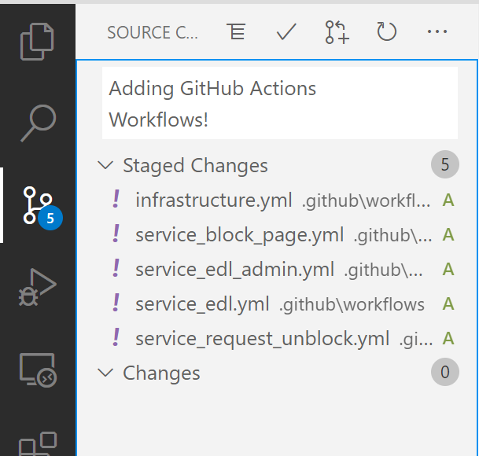
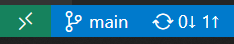

# 3. GitHub Actions


**Please read GitHubs introduction to Actions [here](https://docs.github.com/en/actions/learn-github-actions/introduction-to-github-actions).** It provides an quick overview of what Actions is, what it can do, and how it works. You will be using Actions to orchestrate building and deploying all the applications and infrastructure in this lab.

### Import Terraform Cloud Credentials
In the email with your lab credentials, you should have also received a *Terraform Cloud API Token*. We need to configure this key in GitHub so our CI/CD pipelines can use it!

 - [ ] Go to the GitHub web interface and browse to your repository
 - [ ] Go to the `Settings` tab
 - [ ] Select `Secrets` (at the bottom on the left menu)
 - [ ] Press `New repository secret`
 - [ ] Call your secret `TF_API_TOKEN`
 - [ ] Paste the API Token from your email into the `Value` field; be sure to get rid of any extraneous spaces (before or after the token)
 - [ ] Now repeat the same process but with a secret called `GCP_TERRAFORM_SVC_ACCT` and a value of the GCP Service Account Key from the last chapter (remember: no new lines!).
 - [ ] Let's repeat a third time! Create a new secret called `PROJECT_ID` with a value of your GCP Project Id (looks like `deep608v5-lab-###`)

One last place for credentials -- Terraform Cloud.

 - [ ] Log into your Terraform Cloud account.
 - [ ] Open your `Workspace` (it should be named like `DEEP608v5-Lab-###`).
 - [ ] Go to the `Variables` tab.
	 * You will see two sections: `Terraform Variables` and `Environment Variables`.
	 * `Terraform Variables` are the inputs to our Terraform configuration.
	 * `Environment Variables` can be used to store credentials and other things that Terraform needs to run.
 - [ ] Create a new `Environment Variable`.
	 * The `Key` will be `GOOGLE_CREDENTIALS`.
   * The `Value` will be your GCP Service Account Key from the last chapter (remember: no new lines!).
   * `Description` is optional. You *should* check `Sensitive` so the Key is write-only.

### VS Code
For the rest of this chapter we are going to be working in VS Code. You can add folders & files with the file browser on the left, and edit those files with the editor on the right. At the end of this section we will `commit` (save) our changes and then `push`  (upload) our commit to GitHub.

### Setup GitHub Actions
GitHub Actions receives the instructions for the its CI/CD pipelines from YAML files contained in your repository. The YAML files are stored in a special folder in the repository.

 - [ ] Create a folder called **.github** in the root of your repository
 - [ ] Create a folder called **workflows** inside that folder

GitHub Actions has the concept of *workflows*, which are individual CI/CD pipelines. Each workflow is defined as a single YAML (.yml) file in the workflows folder. When you create a YAML file defining a workflow in that folder, GitHub automatically detects it and will show your new workflow on the *Actions* tab in the GitHub web interface.

For this lab we are going to be creating 5 *workflows*: 1 each for the containerized apps we will be deploying (4 total), and 1 to deploy all of the infrastructure components. Go ahead and create the YAML files for those 5 workflows:

 - [ ] infrastructure.yml
 - [ ] service_block_page.yml
 - [ ] service_edl.yml
 - [ ] service_edl_admin.yml
 - [ ] service_request_unblock.yml

> **Tip:** Be very careful about indentation when writing YAML -- it matters!
> **Tip:** Anything following a '#' in a YAML file is a *comment*. You will see many comments in the code blocks below to explain the various components.

#### Infrastructure
Let's get the infrastructure workflow built out.

 - [ ] For the rest of this section, you should be adding all the YAML you see to your `infrastructure.yml` file!
 - [ ] First, let's add a name for our workflow
	```yaml
	name: Infrastructure
	```
 - [ ] Next, we will add a trigger for our workflow
	```yaml
	on:
	  push:
	    branches: [ main ]
	    paths:
	    - 'infrastructure/**'
	  pull_request:
	    paths:
	    - 'infrastructure/**'
	```
The *on:* statement indicates the start of a *trigger* definition -- defining when to run this workflow. In this case we trigger the pipeline in two cases, 1. when new code is pushed to the *main* branch of the repository, and 2. when a *pull request* is created (more on this later). Additionally we further scope it to only apply when changes are specifically made to files within the *infrastructure* folder; no need to run our infrastructure pipeline for changes that are not to infrastructure!

 - [ ] Now we will add a *job* to this workflow; this is where we actually start telling our workflow to *do stuff*
	```yaml
	jobs:
	  deploy: # Job identifier; can be used to reference this job
	    name: Deploy # Display name for the job
	    runs-on: ubuntu-latest # We want this job to execute on an Ubuntu Linux machine

	    steps: # Each action that our pipeline takes will be defined as a step
	    - name: Checkout # Our first step is to checkout our code!
	      uses: actions/checkout@v2
	```

 - [ ] Let's add our next step; be sure to indent it to the same depth as the previous step
	```yaml
	    - name: Setup Terraform # Name of the step
	      uses: hashicorp/setup-terraform@v1 # Name of the Action to use
	      with: # Parameters for the Action
	        cli_config_credentials_token: ${{ secrets.TF_API_TOKEN }}
	```
In this step we use a pre-made action from the **GitHub Marketplace**. Go ahead and take a quick look at the marketplace [here](https://github.com/marketplace?type=actions). The *setup-terraform* action downloads the current version of Terraform to the *build agent* (where the pipeline is running) and configures it. Note that we are also providing some credentials to Terraform -- these are sourced from the GitHub *secret* that you configured before. These will be used by Terraform when connecting to your Terraform Cloud Workspace.

 - [ ] Time to do something with Terraform now that we have it configured!
	```yaml
	    - name: Terraform Format
	      id: fmt
	      working-directory: ./infrastructure
	      run: terraform fmt -check
	      continue-on-error: true

	    - name: Terraform Init
	      id: init
	      working-directory: ./infrastructure
	      run: terraform init

	    - name: Terraform Plan
	      id: plan
	      if: github.event_name == 'pull_request'
	      working-directory: ./infrastructure
	      run: terraform plan -no-color
	      continue-on-error: true
	```
With these three steps, we do three things:
1. Run the Terraform format checker against our Terraform code (to make sure it's formatted correctly!)
2. Initialize Terraform. This downloads any needed Terraform *providers*. Providers are used to interact with third-party services, such as GCP, AWS, or Azure.
3. Tell Terraform to create a *Plan*. One of the best features of Terraform is that it can analyze your code and your infrastructure, determine the differences between them, and tell you exactly what it is going to do (create, modify, delete) before doing it!

This next one is a beast, bear with us.

 - [ ] Here we do some magic: using the *github-script* Action we take our Terraform Plan and document it in our pull request for review; this way we can review the infrastructure change plan before deciding if we want to apply it!
	```yaml
	    - uses: actions/github-script@0.9.0
	      if: github.event_name == 'pull_request'
	      env:
	        PLAN: "terraform\n${{ steps.plan.outputs.stdout }}"
	      with:
	        github-token: ${{ secrets.GITHUB_TOKEN }}
	        script: |
	          const output = `#### Terraform Format and Style 🖌\`${{ steps.fmt.outcome }}\`
	          #### Terraform Initialization ⚙️\`${{ steps.init.outcome }}\`
	          #### Terraform Plan 📖\`${{ steps.plan.outcome }}\`
	          <details>
	          <summary>Show Plan</summary>
	          ```
	          ${process.env.PLAN}
	          ```
	          </details>
	          
	          **Pusher: \`@${{ github.actor }}\`, Action: \`${{ github.event_name }}\`**`;
	            
	          github.issues.createComment({
	            issue_number: context.issue.number,
	            owner: context.repo.owner,
	            repo: context.repo.repo,
	            body: output
	          })
	```

 - [ ] This is to exit our pipeline if our Terraform plan fails (there is some issue with our code)
	```yaml
	    - name: Terraform Plan Status
	      if: steps.plan.outcome == 'failure'
	      run: exit 1
	```

 - [ ] Lastly, we check to see if this was triggered by a pull request being merged into our *main* branch; if it is, we can proceed with a Terraform *Apply* to actually make the changes we planned and reviewed!
	```yaml
	    - name: Terraform Apply
	      working-directory: ./infrastructure
	      if: github.ref == 'refs/heads/main' && github.event_name == 'push'
	      run: terraform apply -auto-approve
	```

If you want to read more about automating Terraform with GitHub Actions in more depth, check out HashiCorp's guide [here](https://learn.hashicorp.com/tutorials/terraform/github-actions?in=terraform/automation).

<details>
  <summary>Click here to see a complete copy of infrastructure.yml</summary>
  
```
# GitHub Workflow to build the GCP & Kubernetes Infrastructure
name: Infrastructure

# Only run this Workflow for pull requests on branches or pushes to 'main'.
# Limited to commits that make changes to the infrastructure directory in the repo.
on:
  push:
    branches: [ main ]
    paths:
    - 'infrastructure/**'
  pull_request:
    paths:
    - 'infrastructure/**'

jobs:
  deploy:
    name: Deploy
    runs-on: ubuntu-latest

    steps:
    - name: Checkout
      uses: actions/checkout@v2

    - name: Setup Terraform
      uses: hashicorp/setup-terraform@v1
      with:
        cli_config_credentials_token: ${{ secrets.TF_API_TOKEN }}

    - name: Terraform Format
      id: fmt
      working-directory: ./infrastructure
      run: terraform fmt -check
      continue-on-error: true

    - name: Terraform Init
      id: init
      working-directory: ./infrastructure
      run: terraform init

    - name: Terraform Plan
      id: plan
      if: github.event_name == 'pull_request'
      working-directory: ./infrastructure
      run: terraform plan -no-color
      continue-on-error: true

    - uses: actions/github-script@0.9.0
      if: github.event_name == 'pull_request'
      env:
        PLAN: "terraform\n${{ steps.plan.outputs.stdout }}"
      with:
        github-token: ${{ secrets.GITHUB_TOKEN }}
        script: |
          const output = `#### Terraform Format and Style 🖌\`${{ steps.fmt.outcome }}\`
          #### Terraform Initialization ⚙️\`${{ steps.init.outcome }}\`
          #### Terraform Plan 📖\`${{ steps.plan.outcome }}\`
          <details>
          <summary>Show Plan</summary>
          ```
          ${process.env.PLAN}
          ```
          </details>
          
          **Pusher: \`@${{ github.actor }}\`, Action: \`${{ github.event_name }}\`**`;
            
          github.issues.createComment({
            issue_number: context.issue.number,
            owner: context.repo.owner,
            repo: context.repo.repo,
            body: output
          })

    - name: Terraform Plan Status
      if: steps.plan.outcome == 'failure'
      run: exit 1

    - name: Terraform Apply
      working-directory: ./infrastructure
      if: github.ref == 'refs/heads/main' && github.event_name == 'push'
      run: terraform apply -auto-approve
```
</details>
*(your file should look like this!)*

### Our First Container: *Block Page*
As you may recall from the architecture overview, the *Block Page* app is just a basic web page to simulate (for the purpose of this lab) a user's experience when hitting a URL filter block page. In this section we are going to write a GitHub Workflow that uses Docker to build a container image that contains our web page as well as the *Nginx* web server to serve that page. We will then push that container image to our Container Registry in GCP!

 - [ ] Take a moment and go look at the "app", you can find it in the `services/block-page` folder in your repository. You will note that in addition to the HTML file for our web page, there is also a *Dockerfile*: this is a set of instructures for Docker on how to build our container!
	 
	 `FROM nginx:alpine`
	 Here, we tell Docker that we want to use the `nginx` *base image*. This is a pre-made container that already has the Nginx web server installed and configured. Our Docker build will simply layer on top of this image. `alpine` is the Docker *Tag* that we are requesting; you can think of tags as versions. In this case the `alpine` version of this container image is a really slimmed-down version of Linux called *Alpine Linux*; this will give us a nice small container image!

	`COPY *.html /usr/share/nginx/html`
	Here, we tell Docker to copy all our HTML files into the directory where the Nginx web server looks for files to serve.

	That's it! This is a really simple `Dockerfile`.

 - [ ] For the rest of this section, you should be adding all the YAML you see to your `service_block_page.yml` file!
 - [ ] As with the last workflow, first we provide a name and a trigger.
	```
	name: Block Page

	on:
	  push:
	    branches: [ main ]
	    paths:
	    - 'services/block-page/**'
	  pull_request:
	    paths:
	    - 'services/block-page/**'
	```

 - [ ] Now we define our job; there's an extra step on this one!
	```yaml
	jobs:
	  build:
	    name: Build
	    runs-on: ubuntu-latest

	    env:
	      HASH: $(git rev-parse --short "$GITHUB_SHA")
	      PROJECT_ID: ${{ secrets.PROJECT_ID }}

	    steps:
	      - name: Checkout
	        uses: actions/checkout@v2
	```
	Note the addition of `env` this time: here we are grabbing the *hash* (identifier) for the Git *commit* that triggered this workflow run, as well as our GCP project identifier. The hash will be used to *tag* the container image we create (as it's 'version'), and our GCP project id is needed to locate the container *registry* you will push this container image to. A *container registry* is a place to store container images; you can push the images that you built *to* it, and then infrastructure such as Kubernetes can *pull* from it.

 - [ ] Next we use the `setup-gcloud` Action to use the `gcloud` tool to get credentials to connect to our *container registry*
	```yaml
	      - name: Set up gcloud
	        uses: google-github-actions/setup-gcloud@master
	        with:
	          service_account_key: ${{ secrets.GCP_TERRAFORM_SVC_ACCT }}
	          project_id: ${{ secrets.PROJECT_ID }}
	          export_default_credentials: true
	```

 - [ ] Lastly: we `build` our container image, `authenticate` to our container registry, and then `push` our container image.
	```yaml
	      - name: Build
	        working-directory: ./services/block-page
	        run: |-
	          docker build -t gcr.io/$PROJECT_ID/block-page:$GITHUB_SHA -t gcr.io/$PROJECT_ID/block-page:latest .
	          
	      - name: Auth
	        working-directory: ./services/block-page
	        run: |
	          gcloud auth configure-docker -q
	          
	      - name: Push
	        working-directory: ./services/block-page
	        run: |-
	          docker push gcr.io/$PROJECT_ID/block-page:$GITHUB_SHA
	          docker push gcr.io/$PROJECT_ID/block-page:latest
	```
	Note that during the `push` step we push the image twice: with two different *tags*. The first tag is the SHA hash for this Git *commit*, which serves are a unique version. The second tag is `latest`, which tells the container registry that this is the newest version of our container image: for any new requests for our container image that *don't* specify a specific version, give them this version!

<details>
  <summary>Click here to see a complete copy of service_block_page.yml</summary>
  
```
# GitHub Workflow to build the 'Block Page' service using Docker

# The 'Block Page' service is a static HTML page in a Nginx Container.
# It simulates a NGFW URL Filter block page. This page has a link to
# a web form on the 'Request Unblock' service.

name: Block Page

# Only run this Workflow for pull requests on branches or pushes to 'main'.
# Limited to commits that make changes to the service's directory in the repo.
on:
  push:
    branches: [ main ]
    paths:
    - 'services/block-page/**'
  pull_request:
    paths:
    - 'services/block-page/**'

jobs:
  build:
    name: Build
    runs-on: ubuntu-latest

    env:
      HASH: $(git rev-parse --short "$GITHUB_SHA")
      PROJECT_ID: ${{ secrets.PROJECT_ID }}

    steps:
      - name: Checkout
        uses: actions/checkout@v2

      - name: Set up gcloud
        uses: google-github-actions/setup-gcloud@master
        with:
          service_account_key: ${{ secrets.GCP_TERRAFORM_SVC_ACCT }}
          project_id: ${{ secrets.PROJECT_ID }}
          export_default_credentials: true

      - name: Build
        working-directory: ./services/block-page
        run: |-
          docker build -t gcr.io/$PROJECT_ID/block-page:$GITHUB_SHA -t gcr.io/$PROJECT_ID/block-page:latest .

      - name: Auth
        working-directory: ./services/block-page
        run: |
          gcloud auth configure-docker -q

      - name: Push
        working-directory: ./services/block-page
        run: |-
          docker push gcr.io/$PROJECT_ID/block-page:$GITHUB_SHA
          docker push gcr.io/$PROJECT_ID/block-page:latest
```
</details>
(your file should look like this!)

### The Other Containers: *EDL, EDL Admin, & Request Unblock*
These workflow definitions follow the same format as the previous one; as such, we are not going to walk through it line-by-line again. Each of these apps also has their own `Dockerfile`: go ahead and take a moment to review them (they can be found in each of the app folders underneath the `services/` folder in the root of your repository). Docker (the company) has a detailed reference of what you can do in a `Dockerfile` [here](https://docs.docker.com/engine/reference/builder/). You can in most cases find good Dockerfile templates to start from (for your language of choice) with a good Google search.

 - [ ] Fill in `service_edl.yml`.
<details>
  <summary>Click here to see a complete copy of service_edl.yml</summary>
  
```
# GitHub Workflow to build the 'EDL' service using Docker

# The 'EDL' service is a Python app that serves our the
# list of approved (unblocked) URLs in a text format that
# NGFW's and other URL filtering devices can consume. The
# list of URLs is stored in Redis and pulled by this app.

name: EDL

# Only run this Workflow for pull requests on branches or pushes to 'main'.
# Limited to commits that make changes to the service's directory in the repo.
on:
  push:
    branches: [ main ]
    paths:
    - 'services/edl/**'
  pull_request:
    paths:
    - 'services/edl/**'

jobs:
  build:
    name: Build
    runs-on: ubuntu-latest

    env:
      HASH: $(git rev-parse --short "$GITHUB_SHA")
      PROJECT_ID: ${{ secrets.PROJECT_ID }}

    steps:
      - name: Checkout
        uses: actions/checkout@v2

      - name: Set up gcloud
        uses: google-github-actions/setup-gcloud@master
        with:
          service_account_key: ${{ secrets.GCP_TERRAFORM_SVC_ACCT }}
          project_id: ${{ secrets.PROJECT_ID }}
          export_default_credentials: true

      - name: Build
        working-directory: ./services/edl
        run: |-
          docker build -t gcr.io/$PROJECT_ID/edl:$GITHUB_SHA -t gcr.io/$PROJECT_ID/edl:latest .
          
      - name: Auth
        working-directory: ./services/edl
        run: |
          gcloud auth configure-docker -q
          
      - name: Push
        working-directory: ./services/edl
        run: |-
          docker push gcr.io/$PROJECT_ID/edl:$GITHUB_SHA
          docker push gcr.io/$PROJECT_ID/edl:latest
```
</details>

 - [ ] Fill in `service_edl_admin.yml`.
<details>
  <summary>Click here to see a complete copy of service_edl_admin.yml</summary>
  
```
# GitHub Workflow to build the 'EDL Admin' service using Docker

# The 'EDL Admin' service is a Go (Golang) app that is used to
# approve or deny requests from the 'Unblock Request' service.
# This app reads the current list of requests from the Redis
# database that the 'Unblock Request' service writes to.

name: EDL Admin

# Only run this Workflow for pull requests on branches or pushes to 'main'.
# Limited to commits that make changes to the service's directory in the repo.
on:
  push:
    branches: [ main ]
    paths:
    - 'services/edl-admin/**'
  pull_request:
    paths:
    - 'services/edl-admin/**'

jobs:
  build:
    name: Build
    runs-on: ubuntu-latest

    env:
      HASH: $(git rev-parse --short "$GITHUB_SHA")
      PROJECT_ID: ${{ secrets.PROJECT_ID }}

    steps:
      - name: Checkout
        uses: actions/checkout@v2

      - name: Set up gcloud
        uses: google-github-actions/setup-gcloud@master
        with:
          service_account_key: ${{ secrets.GCP_TERRAFORM_SVC_ACCT }}
          project_id: ${{ secrets.PROJECT_ID }}
          export_default_credentials: true

      - name: Build
        working-directory: ./services/edl-admin
        run: |-
          docker build -t gcr.io/$PROJECT_ID/edl-admin:$GITHUB_SHA -t gcr.io/$PROJECT_ID/edl-admin:latest .

      - name: Auth
        working-directory: ./services/edl-admin
        run: |
          gcloud auth configure-docker -q

      - name: Push
        working-directory: ./services/edl-admin
        run: |-
          docker push gcr.io/$PROJECT_ID/edl-admin:$GITHUB_SHA
          docker push gcr.io/$PROJECT_ID/edl-admin:latest
```
</details>

 - [ ] Fill in `service_request_unblock.yml`.
<details>
  <summary>Click here to see a complete copy of service_request_unblock.yml</summary>
  
```
# GitHub Workflow to build the 'Request Unblock' service using Docker

# The 'Request Unblock' service is a Rust app that provides a web form
# that users can use to submit a request to unblock a URL. Requests are
# saved in a Redis database that the services can pull from.

name: Request Unblock

# Only run this Workflow for pull requests on branches or pushes to 'main'.
# Limited to commits that make changes to the service's directory in the repo.
on:
  push:
    branches: [ main ]
    paths:
    - 'services/request-unblock/**'
  pull_request:
    paths:
    - 'services/request-unblock/**'

jobs:
  build:
    name: Build
    runs-on: ubuntu-latest

    env:
      HASH: $(git rev-parse --short "$GITHUB_SHA")
      PROJECT_ID: ${{ secrets.PROJECT_ID }}

    steps:
      - name: Checkout
        uses: actions/checkout@v2

      - name: Set up gcloud
        uses: google-github-actions/setup-gcloud@master
        with:
          service_account_key: ${{ secrets.GCP_TERRAFORM_SVC_ACCT }}
          project_id: ${{ secrets.PROJECT_ID }}
          export_default_credentials: true

      - name: Build
        working-directory: ./services/request-unblock
        run: |-
          docker build -t gcr.io/$PROJECT_ID/request-unblock:$GITHUB_SHA -t gcr.io/$PROJECT_ID/request-unblock:latest .

      - name: Auth
        working-directory: ./services/request-unblock
        run: |
          gcloud auth configure-docker -q

      - name: Push
        working-directory: ./services/request-unblock
        run: |-
          docker push gcr.io/$PROJECT_ID/request-unblock:$GITHUB_SHA
          docker push gcr.io/$PROJECT_ID/request-unblock:latest
```
</details>

### Commit & Push Our Changes!
At last we will `commit` (save) our changes and then `push`  (upload) our commit to GitHub.



 - [ ] Be sure you have saved changes to all your files before continuing! (there is a `Save All` option in the `File` menu to make it easy)
 - [ ] Go to the *Git* tab in VS Code (see screenshot).
 - [ ] Press the `+` next to the word *Changes* to add all changed files to your commit.
 - [ ] Fill in a *commit message* in the text box near the top.
 - [ ] Press the *check* button at the top to complete your commit.



 - [ ] Lastly, use the `Synchronize Changes` button (circle with arrows) to `push` our `commit` to GitHub. The 0 indicates that there are 0 new changes from GitHub to `pull` (*download*), and 1 new change to `push` (*upload*).

## Continue to [Chapter 4](chapter4.md) (Terraform: GCP)