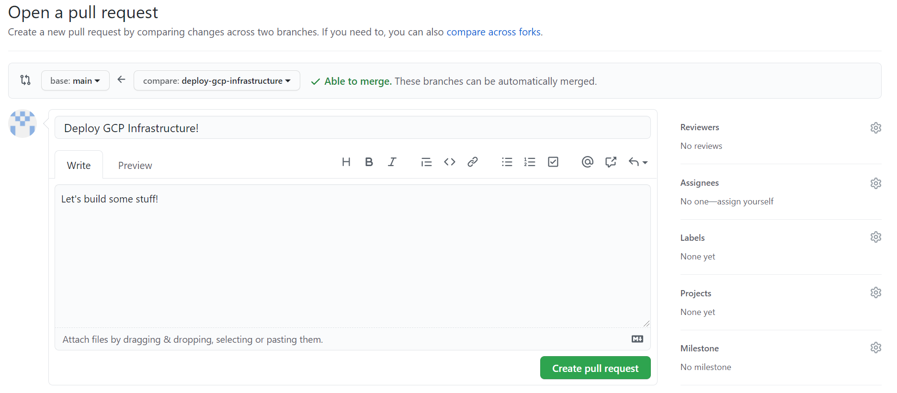

# 3. Terraform: Google Cloud
### Terraform Overview
Terraform is a tool for building, changing, and versioning infrastructure safely and efficiently. Terraform is an Infrastructure-as-Code (IaC) tool: we can design our infrastructure in a text-based configuration language and then commit those configurations to the same Git repository as the code for our app.

Configuration files describe to Terraform the components needed to run a single application or your entire datacenter (or cloud). Terraform generates an execution plan describing what it will do to reach the desired state, and then executes it to build the described infrastructure. As the configuration changes, Terraform is able to determine what changed and create incremental execution plans which can be applied.

The infrastructure Terraform can manage includes low-level components such as compute instances, storage, and networking, as well as high-level components such as DNS entries, SaaS features, etc.

In this lab, we will be using Terraform to deploy all our infrastructure, as well as configure much of that infrastructure -- such as Kubernetes.

### Create a Git `Branch`
We are going to create a new Git `branch` to work from. It is a best practice to avoid commiting directly to your `main` branch as we did in the last chapter. The high level process looks like this:

1. Create a branch (often called a *feature* branch for net-new code or a *bugfix* branch for a... bugfix).
2. Make your changes in your branch.
3. Commit & push your changes.
4. Create a `pull request` in GitHub. A `pull request` is a construct on GitHub wherein you are requesting that code in a `branch` be 'pulled' into the `main` branch. This request is an opportunity to review and test the code before moving it into our `main` branch. In *Chapter 3*, we added some code to our GitHub Actions Workflow to automatically run a `terraform plan` and document it in our pull request; this means that we are going to get to preview our infrastructure changes in our pull request before executing them!

Let's get started.


 - [ ] Press on the `main` button at the bottom left of your VS Code interface; a menu will open the top of your screen.
 - [ ] Select `+ Create new branch...` and then enter a branch name (ex: `deploy-gcp-infrastructure`).
 - [ ] You should now see your new branch name at the bottom left of your VS Code interface, indicating that you have switched from the `main` branch to your new branch. You can always click the branch button to open the dropdown from the previous step, which allows switching between branches in addition to creating new ones.

### Basic Setup & Variables
There are two Terraform configurations that have already been provided for you in the repository template: `terraform.tf` and `variables.tf`. Let's take a moment to review them.

`terraform.tf` contains the basic settings for Terraform. This includes what version of the Terraform tool we want to use, and where we want to store our Terraform `state`. State is how we track what our infrastructure looks like: every time terraform makes changes, it documents the composition of the infrastructure in its state. Out of the box, Terraform will store state in a local file; for this lab we are using Terraform Cloud to store our state centrally. This configuration block tells Terraform about our Terraform Cloud Workspace.

 - [ ] The Terraform Cloud Organization has already been filled in for your, no need to do anything there.
 - [ ] Go ahead and update the Workspace name to the name that was provided to you in the email with all your lab credentials.

The `variables.tf` defines variables that we will use in our Terraform configurations. This makes Terraform configurations more modular and reusable (and prevents us having to copy/paste a lot!). `locals` are fixed variables that are local to to this Terraform configuration, whereas `variables` are variables that can be provided as *input* when applying this configuration. This gives us the ability to provide dynamic input when the configuration is applied.

### Google Cloud Provider
Terraform has the concept of `provider`. A provider is essentially an importable module that enables adds support for a third-party service to Terraform. In this case we are using the Google Cloud provider to add the ability to create Google Cloud resources to Terraform. You can review Terraform's provider *registry* [here](https://registry.terraform.io/browse/providers) to see a list of services you could configure with Terraform.

 - [ ] Create a new file in the `infrastructure/` folder called `gcp_provider.tf`.
 - [ ] Add the provider configurations from below. Note that we are using both the `google` and `google-beta` providers. We need the beta provider for this lab as there is a feature (Kubernetes VPC_NATIVE mode) that we need! Also note that we are telling the provider about our Google Cloud Project, Region, and Zone via the local variables you saw in the last section.

<details>
  <summary>gcp_provider.tf</summary>
  
```
# Enable the GCP Terraform Provider
# This will be used to deploy our Kubernetes cluster and other related cloud resources
# https://registry.terraform.io/providers/hashicorp/google/latest/docs
provider "google" {
  project     = local.gcp_project
  region      = local.gcp_region
  zone        = local.gcp_zone
}

# The GCP Beta Provider is being used for GKE's 'VPC_NATIVE' mode
# (necessary to integrate with Redis)
# https://registry.terraform.io/providers/hashicorp/google-beta/latest/docs
provider "google-beta" {
  project     = local.gcp_project
  region      = local.gcp_region
  zone        = local.gcp_zone
}
```
</details>

### Let's Deploy a Kubernetes Cluster!
Google Cloud provides a managed Kubernetes service called Google Kubernetes Engine, or GKE for short. We will be using it as a platform for the services that make up our application. Let's build a cluster.

There are two Terraform `resources` required to build a basic GKE cluster: a `GKE` resource, and a `GKE Node Pool` resource. The `GKE` resource defines the cluster control plane: high level settings for the cluster itself. The `GKE Node Pool` resource tells GKE what about the VMs we want it to use to run our workloads: things like how many VMs and what size (CPUs, RAM, etc).

 - [ ] Create a new file in the `infrastructure/` folder called `gcp_gke.tf`.
 - [ ] Let's add the `GKE` resource.
	```hcl
	# Kubernetes Cluster
	# https://registry.terraform.io/providers/hashicorp/google/latest/docs/resources/container_cluster
	resource "google_container_cluster" "gke" {
	  provider                 = google-beta
	  name                     = local.gke_name
	  location                 = local.gcp_region
	  remove_default_node_pool = true
	  initial_node_count       = 1
	  networking_mode          = "VPC_NATIVE"
	  network                  = "default"
	  subnetwork               = "default"
	  ip_allocation_policy {
	    cluster_ipv4_cidr_block  = "/16"
	    services_ipv4_cidr_block = "/22"
	  }
	}
	```
	A couple things to call out:
		* We are providing the `name` and `location` for our cluster from the `local` variables we reviewed before.
		* We are using the `default` network in your GCP lab account to host the cluster.

 - [ ] Now we can create our `Node Pool`.
	 ```hcl
	# Kubernetes Cluster - Node Pool
	# https://registry.terraform.io/providers/hashicorp/google/latest/docs/resources/container_node_pool
	resource "google_container_node_pool" "gke_pool" {
	  name       = "${local.gke_name}-pool"
	  location   = local.gcp_region
	  cluster    = google_container_cluster.gke.name
	  node_count = 1
	  node_config {
	    preemptible  = true
	    machine_type = local.gke_node_size
	    oauth_scopes = [
	      "https://www.googleapis.com/auth/cloud-platform"
	    ]
	  }
	}
	```
	Note that we tie these two resources together with the `cluster` attribute. One of the more powerful features of Terraform is that you can take data from one resource and reference it when creating another. Also note that we are providing a VM size to use for compute nodes with the `machine_type` attribute.

You can get complete examples and detailed documentation of all the available attributes for any resource on the Terraform documentation site. In this lab, you will see a link to the relevant resource documentation for each resource that we deploy in the comment above the resource configuration (see above).

That's it! When we run Terraform in our GitHub Actions CI/CD pipeline later, the configuration you just created will create an entire Kubernetes Cluster!

### Redis
The services that make up our application will use `Redis` to store data. Redis is an easy-to-use database that is commonly used for caching frequently used data. You can read more about it [here](https://redis.io/). We will be using Google's Cloud Memorystore, which is a fully managed (PaaS) version of Redis on Google Cloud.

 - [ ] Create a new file in the `infrastructure/` folder called `gcp_redis.tf`.
 - [ ] Add the Redis resource configuration to the file:
	```hcl
	# Deploy Redis Instance
	# https://registry.terraform.io/providers/hashicorp/google/latest/docs/resources/redis_instance
	resource "google_redis_instance" "redis" {
	  name           = local.redis_name
	  memory_size_gb = 1
	  region         = local.gcp_region
	  location_id    = local.gcp_zone
	}
	```
	We define the name of our Redis instance, how much memory (storage) to allocate, and which GCP region and zone we want it in. Easy!

### `Commit` & `Push`!
Our work here is done, let's save our changes and create some infrastructure!

 - [ ] Be sure to save all the files you edited.
 - [ ] Commit your changes. See the end of [Chapter 3](chapter3.md) for a reminder on how to do that.
 - [ ] Push your changes. You will notice that the synchronize button now looks like a cloud with an up arrow: this is to tell you that you are pushing a new branch to GitHub (and not just changes to an existing branch).

### Your First Pull Request
Now we are going to create a `pull request` to get the changes in our branch into the `main` branch. Let's switchover to the GitHub web interface.



 - [ ] Go to the `Pull requests` tab.
 - [ ] You should see a `Compare & pull request` button referencing the branch you just pushed.
 - [ ] You will be asked to provide a title and comment for your pull request. Also note that at the bottom of the page it shows you a `diff` of the changes you made: the difference between the files in your branch, and the `main` branch.
 - [ ] Now some magic happens: remember that pull request trigger we added to our Workflow? Go to the `Actions` tab and you should see a Workflow run in progress for your new pull request. Click on it to watch the progress as Terraform creates a plan for the infrastructure changes.
 - [ ] Once the Workflow run completes successfully, return to your pull request. If it doesn't complete successfully, we will need to troubleshoot before proceeding further.
 - [ ] Review the comment that has been added to your pull request by the Workflow. You can see all the details of Terraform's plan for building your infrastructure
 - [ ] If everything looks good... go ahead and hit `Merge pull request`! This will move your code into the `main` branch and kickoff your Workflow again -- this time to actually build the infrastructure, not just `plan` it.
 - [ ] You will be prompted to delete your branch -- go ahead and do so, we are done with it.
 - [ ] Now go back to the `Actions` tab and open the Workflow run that is in progress to watch Terraform do its work! If the Workflow does not complete successfully (green check), we will need to troubleshoot.

If you like, you can now log into the GCP console (go back to Okta and click the app icon) and review the GKE cluster you just created in the console web UI. You can just search `gke` in the search bar up top and select `Kubernetes Engine` after logging in to get to the right place quickly. If you click on your newly created cluster from the `Clusters` tab, you can review its details and status.

Before you go...

 - [ ] Go back to VS Code.
 - [ ] Press the `branch` button at the bottom left of VS Code and select the `main` branch from the dropdown.
 - [ ] Press the synchronize button to pull down the changes we just made to the `main` branch.

That's it for today!

## Day 2 & Day 3
Tomorrow we will be deploying the app containers on the Kubernetes cluster you just deployed. On Thursday we will be integrating with Okta to enable authentication for our app. See you tomorrow!